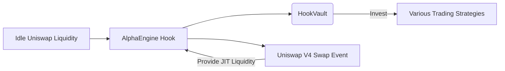

# AlphaEngine

**AlphaEngine** is a Uniswap V4 Hook prototype that unlocks idle liquidity from stablecoin pools, directing it into a permissionless marketplace of profitable trading strategies. By dynamically allocating otherwise unused liquidity to vetted strategies, AlphaEngine aims to maximize returns for liquidity providers while creating a transparent platform for developers and quants to monetize their trading expertise.

---

## Table of Contents
1. [Overview](#overview)
2. [Key Features](#key-features)
3. [Architecture](#architecture)
4. [How It Works](#how-it-works)
5. [Project Structure](#project-structure)
6. [Tests & Coverage](#tests--coverage)
7. [Future Extensions](#future-extensions)
8. [Contact & Contribution](#contact--contribution)
9. [Acknowledgments](#acknowledgments)

---

## Overview
Uniswap’s stablecoin pools often see **up to 90%** of liquidity remaining idle. **AlphaEngine** bridges this gap by:
- Allowing DeFi strategists to propose and run verified strategies using that otherwise idle capital.
- Dynamically pulling liquidity into these strategies via **Uniswap V4 Hooks**—only when beneficial—while preserving minimal impact on normal trading.
- **Automatically** depositing unused liquidity into aggregator vaults (e.g., `HookVault`) that invest in multiple trading strategies, generating additional yield.

**Our Mission**: Empower liquidity providers (LPs) with superior APRs while opening a permissionless marketplace for global strategy creators.

---

## Key Features

1. **Uniswap V4 Hook Integration**  
   - **Before/After Swap Logic**: Temporarily provides ephemeral “just-in-time” liquidity for specific swaps.  
   - **Deposits & Withdrawals**: If liquidity isn’t actively used, it remains in `HookVault` generating additional returns.

2. **Idle Liquidity Optimization**  
   Harness inactive Uniswap liquidity to generate yield through multiple trading strategies, governed by a flexible aggregator vault (`HookVault`).

3. **Multi-Strategy Investments**  
   Tokens sent to `HookVault` are invested across multiple strategies, enabling diversification and risk management, while ensuring the Hook can withdraw capital *just in time* for swaps if needed.

4. **Permissionless Strategy Marketplace**  
   Anyone worldwide can propose, backtest, and (upon approval) deploy a trading strategy. Once whitelisted, the strategy can seamlessly tap into stablecoin liquidity via our Uniswap Hook.

5. **Educative Focus**  
   AlphaEngine is working in collaboration with EDUChain to guide new or experienced quants through building, testing, and proving their alpha strategies via zero-knowledge methods or robust backtesting frameworks.

---

## Architecture

1. **Idle Liquidity**: Initially sitting in stablecoin pools.  
2. **AlphaEngine Hook**: Intercepts swaps and add/remove liquidity on-the-fly.  
3. **HookVault**: Aggregates assets, invests in multiple strategies, or holds them until a JIT swap event triggers a withdrawal.

---

## How It Works
1. **User Deposits**  
   - LPs deposit tokens into our Hook (via `addLiquidity`), which in turn calls `HookVault.deposit(...)`.  
   - The vault invests these tokens across multiple whitelisted strategies.

2. **JIT Swap**  
   - During a Uniswap swap, the Hook withdraws from the vault only if extra liquidity can enhance returns or lower slippage.  
   - After the swap completes, leftover tokens are re-deposited automatically to keep earning yield.

3. **Strategy Proposals**  
   - Strategy creators propose a new alpha approach, passing risk checks (backtesting, potential ZK proofs, etc.).  
   - If approved, it gains access to a portion of the aggregator vault’s liquidity for real-time usage.

4. **Returns & Transparency**  
   - Strategies share a portion of profits with LPs.  
   - Full logs and (optional) zero-knowledge attestations ensure that only safe or “vetted” strategies can handle user funds.

---

## Project Structure
```
.
├── src
│   └── Hook.sol                # Primary Hook logic for JIT liquidity & aggregatorVault integration
├── test
│   └── HookIntegration.t.sol   # Integration tests verifying deposit, JIT swaps, etc.
├── foundry.toml                # Foundry configuration
├── remappings.txt              # Remappings for imports
├── package.json                # Basic project metadata
├── .solhint.json               # Solhint config
├── .prettierrc                 # Prettier config for Solidity
└── README.md                   # This file
```
*We have removed older mock or ancillary files (like `MockAavePool`, `MockTeller.sol`, etc.) to focus on the aggregator vault approach.*

---

## Tests & Coverage

### Running the Tests
We use [Foundry](https://book.getfoundry.sh/) for our test framework. To run all tests:

```bash
forge test
```

or for verbose output:

```bash
forge test -vvvv
```

**Additional Options**  
- `--match-test <TESTNAME>` to run a specific test  
- `--gas-report` for a gas usage report

### Test Breakdown

**1. `test_BasicAddLiquidity()`**  
   - Ensures that depositing tokens into the `HookVault` works as expected, verifying correct share balances.

**2. `test_ZeroDeposit()`**  
   - Confirms that attempts to deposit `0` amounts revert with `"No tokens to deposit"`.

**3. `test_EdgeCase_AllOneTokenToVeda()`**  
   - Demonstrates partial deposits (e.g., only token0) still function seamlessly.

**4. `test_InsufficientBalance()`**  
   - Confirms that a user with insufficient tokens reverts properly on `transferFrom`.

**5. `test_ReAddLiquiditySameUser()`**  
   - Verifies that multiple consecutive deposits from the same user accumulate shares correctly.

**6. `test_AddLiquidity_NoEffectWithHookData()`**  
   - Checks that extra hook data does not affect deposit logic.

**7. `test_BasicSwap_With_JIT()`**  
   - Validates the ephemeral JIT (just-in-time) liquidity cycle, withdrawing from `HookVault` and then returning leftover tokens.

**Additional Corner Cases**  
- *Dust Swap*  
- *Large Overflow Swap*  
- *Exceeding aggregatorVault liquidity*  
- *Partial usage across multiple swaps*  
- *No aggregatorVault shares => normal swap*

### Coverage Report

```
Analysing contracts...
Running tests...

Ran 13 tests for test/HookIntegration.t.sol:HookIntegrationTest
[PASS] testHook() (gas: 3135)
[PASS] test_AddLiquidity_NoEffectWithHookData() (gas: 492490)
[PASS] test_BasicAddLiquidity() (gas: 507561)
[PASS] test_BasicSwap_With_JIT() (gas: 5332670)
[PASS] test_EdgeCase_AllOneTokenToVeda() (gas: 305531)
[PASS] test_InsufficientBalance() (gas: 146693)
[PASS] test_ReAddLiquiditySameUser() (gas: 616242)
[PASS] test_Swap_ExceedsAvailableLiquidity() (gas: 2402018)
[PASS] test_Swap_Huge_AmountPotentialOverflow() (gas: 2405061)
[PASS] test_Swap_NoVaultShares() (gas: 1647974)
[PASS] test_Swap_PartialUsage_ThenMoreSwaps() (gas: 5316611)
[PASS] test_Swap_VerySmallDust() (gas: 2403354)
[PASS] test_ZeroDeposit() (gas: 113090)
Suite result: ok. 13 passed; 0 failed; 0 skipped; finished in 51.41ms (138.73ms CPU time)

Ran 1 test suite in 352.23ms (51.41ms CPU time): 13 tests passed, 0 failed, 0 skipped (13 total tests)

╭-------------------+------------------+------------------+----------------+----------------╮
| File              | % Lines          | % Statements     | % Branches     | % Funcs        |
+===========================================================================================+
| src/Hook.sol      | 74.29% (104/140) | 76.51% (114/149) | 53.85% (14/26) | 73.33% (11/15) |
|-------------------+------------------+------------------+----------------+----------------|
| src/HookVault.sol | 90.00% (36/40)   | 92.31% (36/39)   | 13.64% (3/22)  | 85.71% (6/7)   |
|-------------------+------------------+------------------+----------------+----------------|
| Total             | 77.78% (140/180) | 79.79% (150/188) | 35.42% (17/48) | 77.27% (17/22) |
╰-------------------+------------------+------------------+----------------+----------------╯
```


---

## Future Extensions
- **Cross-chain Compatibility**  
  Expand aggregator logic to tap stable liquidity across multiple networks.  
- **Stronger Verification & Privacy**  
  Integrate more sophisticated cryptographic checks (ZK proofs, Merkle-based privacy).  
- **Marketplace & Education**  
  A self-serve environment with robust backtesting, ranking, and educational modules for quants.  
- **AI & Automation**  
  Automate strategy selection, adapt dynamically to market conditions.

---

## Contact & Contribution
- **Team**: Satyajeet, Arpit, Anirudh, Nilay  
- **Inquiries or Collaboration**: Please open an issue or PR on this repository.  

We welcome discussion, bug reports, and feature requests. For direct contacts or private queries, please reach out via GitHub or email.

---

## Acknowledgments
**AlphaEngine** extends gratitude to the Uniswap Hooks Incubator, Atrium Academy and the Foundry ecosystem, and the broader DeFi community for guidance. Special thanks to all who contributed to testing and refining the aggregator approach. 

**Thank you** for exploring **AlphaEngine**. We welcome questions, feedback, and collaboration to push DeFi liquidity utilization to the next level!
